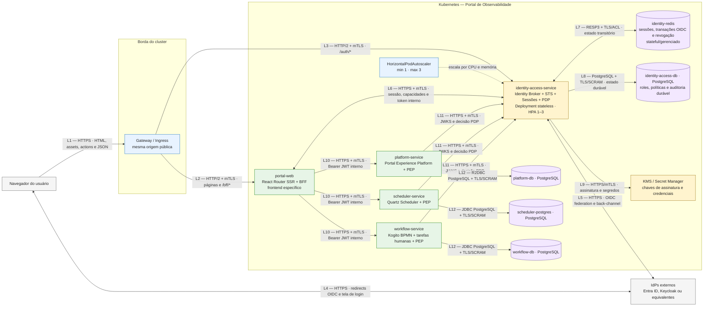
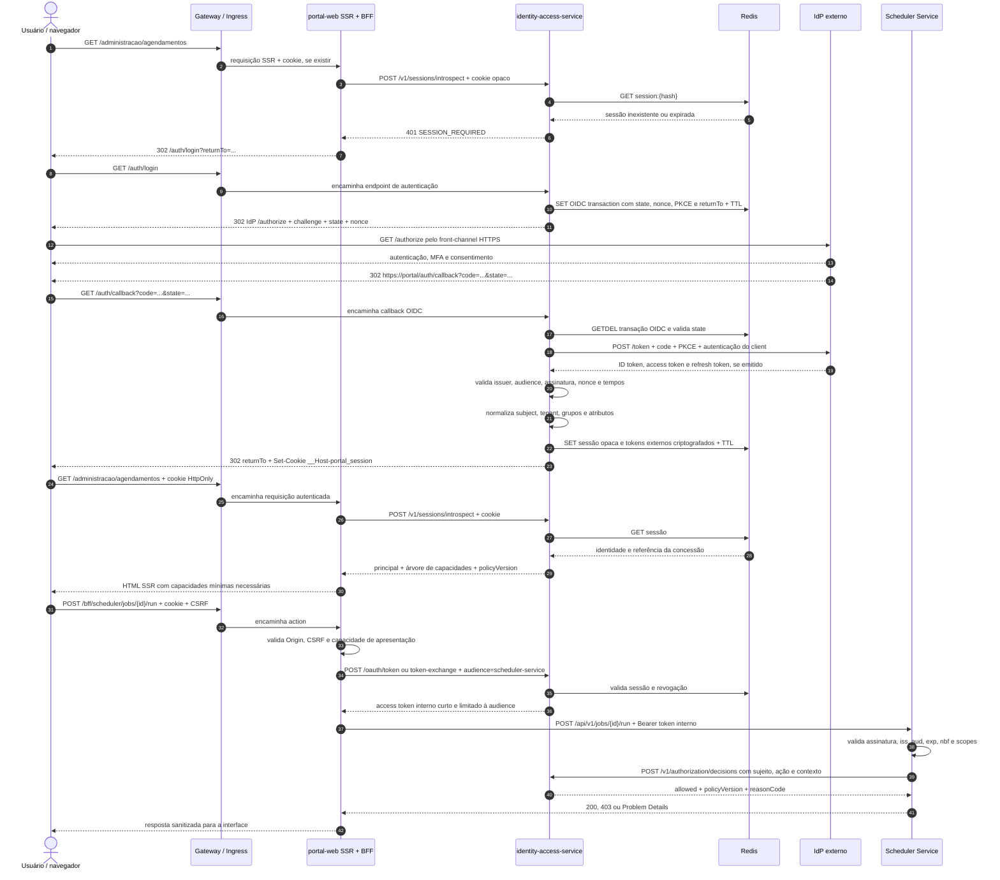

# Identidade, autenticação e autorização

**Status:** proposta de arquitetura
**Escopo:** `portal-web`, `identity-access-service`, `platform-service`,
`scheduler-service` e `workflow-service`
**Última revisão:** 4 de outubro de 2026

A relação funcional completa entre esses componentes está em
[Visão de serviços do produto](./visao-de-servicos.md).

## Decisão resumida

A segurança de produto fica centralizada no **`identity-access-service`**.
Esse serviço é o único componente que conhece os provedores de identidade
externos. Ele atua como:

- broker OpenID Connect entre o produto e os IdPs externos;
- Authorization Server/Security Token Service do produto;
- gerenciador de sessões opacas armazenadas no Redis;
- resolvedor de roles, permissões e escopos;
- Policy Decision Point (PDP) para decisões de autorização;
- origem da árvore de capacidades apresentada ao frontend;
- origem da trilha de auditoria de identidade e acesso.

O `portal-web`, executado com React Router SSR, continua sendo o **Backend for
Frontend (BFF)** do portal, mas não integra diretamente com o IdP externo. Ele
consulta a sessão no `identity-access-service`, solicita tokens internos
específicos para cada backend e entrega ao navegador apenas uma sessão opaca.

As APIs continuam sendo **Policy Enforcement Points (PEP)**. Centralizar a
política não significa remover a fiscalização das APIs: cada backend deve
validar o token e autorizar a operação no limite do recurso protegido.

> O callback de login não é um webhook. O IdP redireciona o navegador para
> `GET /auth/callback`, publicado pelo `identity-access-service`. O serviço
> então troca o código por tokens diretamente com o IdP por um canal
> servidor-servidor. Webhooks e back-channel logout são integrações opcionais,
> independentes da resposta normal de login.

## Por que centralizar a integração com o IdP

Fazer cada BFF conversar diretamente com o IdP é correto para uma aplicação
isolada e está alinhado ao padrão BFF. Para um produto com múltiplos frontends,
backends e possíveis IdPs, essa abordagem replica responsabilidades sensíveis:

- cadastro de clients, redirect URIs, segredos e certificados;
- validação de issuer, audience, nonce, state e PKCE;
- renovação, revogação e troca de tokens;
- transformação de claims específicas de cada fornecedor;
- mapeamento de grupos externos para roles internas;
- auditoria, políticas de sessão e logout global;
- tratamento diferente para Entra ID, Keycloak ou outro provedor.

O `identity-access-service` cria uma fronteira estável para o produto. Um
IdP externo pode ser substituído ou um novo tenant pode ser incluído sem alterar
o contrato dos BFFs e das APIs.

```text
Contrato externo variável       Contrato interno estável

Entra ID ─┐
Keycloak ─┼─> identity-access-service ──────> subject, roles, capabilities,
Outro IdP ┘                                  tokens e decisões do produto
```

A centralização deliberadamente não inclui toda a execução da segurança:

| Centralizado no `identity-access-service` | Permanece distribuído |
|---|---|
| Federação com IdPs e normalização de identidade | Validação local do token em cada API |
| Sessões, revogação e logout global | Autorização obrigatória no endpoint e caso de uso |
| Emissão e troca de tokens internos | Regras que dependem do estado do próprio domínio |
| Roles, permissões, escopos e decisões PDP | Sanitização de dados e prevenção de IDOR |
| Auditoria de identidade e políticas | Rate limit e auditoria técnica de cada API |

Se apenas o serviço central verificasse a permissão, uma chamada que alcançasse
diretamente um backend poderia contornar o controle. Por isso, as decisões são
centralizadas, mas a aplicação da decisão permanece em todas as fronteiras.

## Visão de containers e componentes



### Responsabilidades

| Componente | Responsabilidade de segurança |
|---|---|
| Navegador | Mantém apenas o cookie opaco de sessão. Nunca recebe access token ou refresh token. |
| Gateway/Ingress | Termina TLS público e encaminha `/auth/*` ao `identity-access-service` e páginas/`/bff/*` ao `portal-web`. Não autoriza operações de negócio. |
| React Router SSR/BFF | Protege loaders/actions, consulta a sessão, obtém capacidades e solicita tokens internos por audience. Não conhece o IdP externo. |
| `identity-access-service` | Federa identidades externas, normaliza claims, administra sessões, emite tokens internos, resolve permissões e responde decisões. |
| Redis | Armazena sessões, `state`, `nonce`, PKCE verifier, tokens externos criptografados, revogações e caches com TTL. |
| IAM PostgreSQL | Persiste usuários normalizados, vínculos, roles, permissões, políticas e auditoria. Sessões não ficam nele. |
| KMS/Secret Manager | Protege chaves de assinatura, certificados dos clients e chaves usadas para criptografar tokens no Redis. |
| `platform-service`, `scheduler-service` e `workflow-service` | Validam o token interno e autorizam cada operação. Nunca confiam em botão oculto nem em permissões enviadas pelo navegador. |

## Fluxo de login e operação protegida



## Escalabilidade e disponibilidade

### `identity-access-service`

O serviço é um `Deployment` stateless. Nenhuma sessão fica na memória de um
pod; por isso qualquer réplica pode atender qualquer requisição. O HPA alvo tem
mínimo de 1 e máximo de 3 réplicas:

```yaml
apiVersion: autoscaling/v2
kind: HorizontalPodAutoscaler
metadata:
  name: identity-access-service
spec:
  scaleTargetRef:
    apiVersion: apps/v1
    kind: Deployment
    name: identity-access-service
  minReplicas: 1
  maxReplicas: 3
  behavior:
    scaleDown:
      stabilizationWindowSeconds: 300
  metrics:
    - type: Resource
      resource:
        name: cpu
        target:
          type: Utilization
          averageUtilization: 60
    - type: Resource
      resource:
        name: memory
        target:
          type: Utilization
          averageUtilization: 70
```

O workload precisa declarar `resources.requests` para CPU e memória e o cluster
precisa fornecer métricas ao HPA. Além de CPU e memória, uma evolução pode usar
latência p95, requisições concorrentes ou tamanho de fila como métricas externas.

`minReplicas: 1` atende ao requisito de custo mínimo, mas não oferece alta
disponibilidade imediata durante falha, manutenção ou subida de carga. Para
produção com requisito de disponibilidade, a recomendação é mudar o mínimo
para 2, manter `PodDisruptionBudget`, anti-affinity e distribuição por zona.

### Redis

O HPA não deve controlar diretamente a quantidade de pods Redis. O Redis é
stateful: aumentar réplicas sem coordenar replicação, eleição e particionamento
não aumenta capacidade de forma segura.

| Ambiente | Topologia recomendada |
|---|---|
| Desenvolvimento/local | Redis único em StatefulSet com PVC; perder o Redis pode invalidar todas as sessões. |
| Produção inicial | Serviço Redis gerenciado ou primary/replica com Sentinel e anti-affinity. |
| Alto volume | Redis Cluster ou operador Kubernetes que administre shards, réplicas, failover e upgrades. |

Configurações mínimas:

- TLS, ACL e credencial exclusiva para o `identity-access-service`;
- `maxmemory-policy noeviction`, evitando expulsão silenciosa de sessões;
- TTL obrigatório em sessão, transação OIDC e caches;
- prefixos distintos por tipo de dado e ambiente;
- limites de conexão, timeouts e circuit breaker no cliente;
- AOF ou persistência conforme o RTO/RPO definido;
- métricas de memória, evictions, conexões, latência, replication lag e failover;
- nunca armazenar token externo em texto claro: usar criptografia de aplicação
  com chave mantida no KMS/Secret Manager.

## Matriz de protocolos

| Linha | Origem → destino | Protocolo e formato | Autenticação e proteção | Uso |
|---|---|---|---|---|
| L1 | Navegador → Gateway | HTTPS, preferencialmente HTTP/2; HTML, assets, JSON e formulários | TLS 1.2+; HSTS; cookie `Secure`, `HttpOnly`, `SameSite=Lax` | Navegação, SSR e chamadas same-origin. |
| L2 | Gateway → `portal-web` | HTTP/2 com mTLS interno | Identidade de workload e NetworkPolicy | Páginas, assets, loaders/actions e `/bff/*`. |
| L3 | Gateway → `identity-access-service` | HTTP/2 com mTLS interno | Identidade de workload, rate limit e NetworkPolicy | `/auth/login`, `/auth/callback`, logout e endpoints públicos controlados. |
| L4 | Navegador ↔ IdP | OIDC Authorization Code com PKCE sobre HTTPS; redirects 302 | `state`, `nonce`, PKCE S256, redirect URI exata e MFA | Front-channel. O callback passa pelo navegador; não é webhook. |
| L5 | `identity-access-service` ↔ IdP | HTTPS; OIDC Discovery, OAuth Token Endpoint, JWKS, revogação e logout | Cliente confidencial com `private_key_jwt` preferencialmente; issuer e audience em allowlist | Federação e troca de código externo. |
| L6 | BFF ↔ `identity-access-service` | HTTPS/mTLS; JSON e OAuth 2.0 Token Exchange quando suportado | Workload autenticado; cookie opaco encaminhado apenas à API de sessão; audience obrigatória | Introspecção da sessão, capacidades e token interno por backend. |
| L7 | `identity-access-service` ↔ Redis | RESP3 com TLS e ACL | Credencial e ACL exclusivas; payload sensível criptografado pela aplicação | Sessões, transações OIDC, revogação e caches com TTL. |
| L8 | `identity-access-service` → IAM PostgreSQL | PostgreSQL wire protocol sobre TCP 5432 com TLS | SCRAM-SHA-256, credencial de menor privilégio e rotação | Identidade normalizada, roles, políticas e auditoria durável. |
| L9 | `identity-access-service` → KMS/Secret Manager | HTTPS/mTLS ou integração nativa do provedor | Workload identity, sem segredos estáticos quando possível | Assinatura de tokens e criptografia de credenciais/tokens externos. |
| L10 | BFF → APIs | HTTPS/mTLS; REST/JSON; OAuth 2.0 Bearer JWT interno | Token curto, audience única, scopes mínimos, `iss`, `sub`, `exp`, `nbf` e `jti` | Operações de negócio em nome do usuário. |
| L11 | APIs → `identity-access-service` | HTTPS/mTLS; JWKS cacheado e decisão JSON versionada | Identidade do workload; sujeito derivado do token validado | Validação de assinatura e decisões contextuais. A API não chama o serviço para validar cada assinatura. |
| L12 | APIs → bancos | Protocolo nativo com TLS | Credenciais distintas, menor privilégio e rotação | Persistência de cada domínio. |

## Árvore de capacidades para o frontend

O `identity-access-service` fornece ao BFF uma projeção estável e
versionada. Ela serve para compor navegação, botões e mensagens, não para
autorizar o backend.

```json
{
  "schemaVersion": "1",
  "principal": {
    "subject": "9b27dff7-3c94-4e7b-a5db-ff4d3cdb7bd0",
    "displayName": "Usuário do Portal",
    "identityProvider": "corporate-entra"
  },
  "roles": ["scheduler-operator"],
  "capabilities": {
    "scheduler": {
      "jobs": {
        "read": { "allowed": true, "scopes": ["group:*"] },
        "create": { "allowed": false, "scopes": [] },
        "run": { "allowed": true, "scopes": ["group:plataforma"] },
        "pause": { "allowed": true, "scopes": ["group:plataforma"] },
        "delete": { "allowed": false, "scopes": [] }
      },
      "executions": {
        "read": { "allowed": true, "scopes": ["group:*"] },
        "interrupt": { "allowed": true, "scopes": ["group:plataforma"] }
      }
    }
  },
  "policyVersion": "2026-10-04T20:00:00Z"
}
```

Os backends não recebem essa árvore do navegador. Para regras contextuais, eles
enviam ao PDP uma decisão derivada do token já validado:

```http
POST /v1/authorization/decisions
Content-Type: application/json
Authorization: Bearer <credencial-do-workload>
```

```json
{
  "subject": "9b27dff7-3c94-4e7b-a5db-ff4d3cdb7bd0",
  "resource": "scheduler.job",
  "action": "run",
  "context": {
    "jobGroup": "plataforma",
    "environment": "production"
  }
}
```

```json
{
  "allowed": true,
  "policyVersion": "2026-10-04T20:00:00Z",
  "reasonCode": "ROLE_PERMISSION_WITHIN_SCOPE"
}
```

O serviço retorna somente códigos de razão seguros. Detalhes internos da
política ficam restritos aos logs de auditoria.

## Roteamento alvo

Hoje o Gateway envia `/api/v1` diretamente para o Scheduler Service. No desenho
alvo, o navegador não alcança essa API diretamente.

| Caminho público | Destino | Observação |
|---|---|---|
| `/` e demais páginas | `portal-web` | SSR e assets. |
| `/auth/*` | `identity-access-service` | Login, callback, logout e federação OIDC. |
| `/bff/*` | `portal-web` | Actions e APIs específicas do frontend. |
| `/api/v1/*` | Sem rota pública, ou bloqueada para navegadores | Acesso apenas do BFF e workloads autorizados. |
| `/security/internal/*` | Sem rota pública | Sessão, token exchange, capacidades e decisões via mTLS. |
| `/actuator/*` | Sem rota pública | Somente probes e operação interna. |

## Requisitos obrigatórios

1. Somente o `identity-access-service` integra com IdPs externos. BFFs e
   APIs confiam no issuer interno do produto.
2. Não armazenar access token, ID token ou refresh token em `localStorage`,
   `sessionStorage`, IndexedDB ou JavaScript do navegador.
3. Usar cookie de sessão com prefixo `__Host-`, `Secure`, `HttpOnly`,
   `Path=/`, sem atributo `Domain` e `SameSite=Lax` ou `Strict`.
4. Proteger toda mutação com método não seguro, token CSRF e validação de
   `Origin`; nenhuma mutação em `GET`.
5. Rotacionar a sessão após login e elevação de privilégio; aplicar timeout de
   inatividade, tempo máximo absoluto e revogação no logout.
6. Usar transação OIDC de uso único no Redis. Consumir `state` com operação
   atômica e rejeitar replay do callback.
7. Validar tokens internos nas APIs, inclusive assinatura, algoritmo
   permitido, issuer, audience, validade e client/actor quando aplicável.
8. Adotar `deny-by-default`. A API deve autorizar endpoint e caso de uso,
   independentemente das capacidades da UI.
9. Derivar o sujeito usado pelo PDP do token validado ou de asserção interna
   assinada, nunca de um header ou payload livre vindo do navegador.
10. Propagar `traceparent` conforme W3C Trace Context e correlation ID, sem
    registrar tokens, códigos OIDC, cookies ou dados pessoais desnecessários.
11. Auditar login, logout, falhas, revogações, alterações de roles e decisões
    sensíveis com sujeito, ação, recurso, resultado e versão da política.
12. Restringir destinos do BFF por allowlist e NetworkPolicy; ele não pode ser
    um proxy aberto.
13. Responder `401` para sessão/token ausente ou inválido e `403` para usuário
    autenticado sem permissão, usando Problem Details sem vazar regras internas.
14. Não implementar um Authorization Server artesanal sem uma biblioteca ou
    produto maduro e auditado. O serviço central deve expor protocolos padrão,
    mesmo que encapsule um broker comercial ou open source.

## Limites e riscos da centralização

O `identity-access-service` vira um ativo crítico e um ponto de falha de
alto impacto. A decisão de centralizar exige:

- SLO, alertas e dashboards próprios;
- readiness que considere Redis, chaves e dependências essenciais;
- rate limiting separado para login, callback, introspecção e decisões;
- rotação de chaves com período de sobreposição no JWKS;
- cache local de JWKS nas APIs para que validação de JWT não dependa de uma
  chamada remota por requisição;
- circuit breaker e política explícita de falha: operações protegidas devem
  falhar fechadas quando uma decisão contextual não puder ser obtida;
- testes de indisponibilidade do Redis, IdP, KMS e IAM PostgreSQL;
- runbooks para revogação de chave, comprometimento de client e logout global.

O Redis permite escalar o serviço central horizontalmente sem sticky session.
Ele não elimina o risco central; apenas remove o estado local dos pods.

## Referências

- [RFC 10017 — OAuth 2.0 for Browser-Based Applications](https://www.rfc-editor.org/rfc/rfc10017)
- [RFC 8693 — OAuth 2.0 Token Exchange](https://www.rfc-editor.org/rfc/rfc8693)
- [Kubernetes — Horizontal Pod Autoscaling](https://kubernetes.io/docs/concepts/workloads/autoscaling/horizontal-pod-autoscale/)
- [Redis — High availability with Sentinel](https://redis.io/docs/latest/operate/oss_and_stack/management/sentinel/)
- [Redis — Kubernetes Operator](https://redis.io/tutorials/operate/orchestration/kubernetes-operator/)
- [React Router — Sessions and Cookies](https://reactrouter.com/explanation/sessions-and-cookies)
- [Spring Security — OAuth 2.0 Resource Server](https://docs.spring.io/spring-security/reference/servlet/oauth2/resource-server/index.html)
- [Spring Security — Method Security](https://docs.spring.io/spring-security/reference/servlet/authorization/method-security.html)
- [OWASP — Authorization Cheat Sheet](https://cheatsheetseries.owasp.org/cheatsheets/Authorization_Cheat_Sheet.html)
- [OWASP — Session Management Cheat Sheet](https://cheatsheetseries.owasp.org/cheatsheets/Session_Management_Cheat_Sheet.html)
- [OWASP — CSRF Prevention Cheat Sheet](https://cheatsheetseries.owasp.org/cheatsheets/Cross-Site_Request_Forgery_Prevention_Cheat_Sheet.html)
