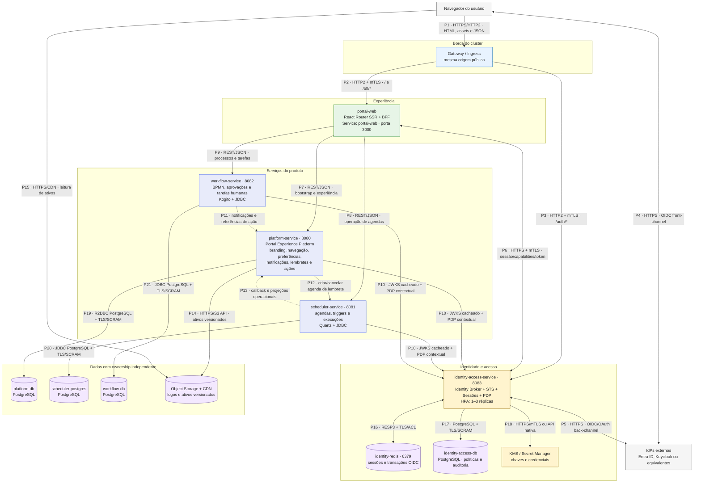
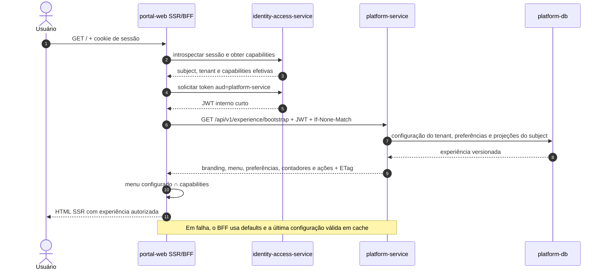
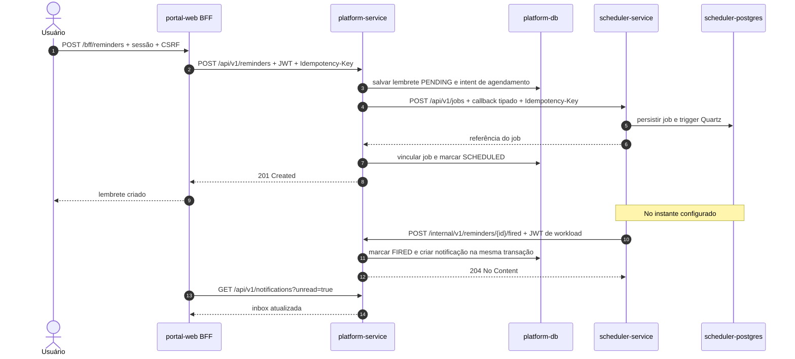

# Visão de serviços do produto

**Status:** proposta de arquitetura
**Escopo:** responsabilidades, dados e protocolos dos serviços do Portal de
Observabilidade
**Última revisão:** 4 de outubro de 2026

## Decisão principal

O `platform-service` será a **Portal Experience Platform**: o serviço que concentra
a configuração e o estado compartilhado da experiência do portal. Ele será a
fonte de verdade para identidade visual, navegação configurável, preferências do
usuário, notificações internas, lembretes e a projeção de ações pendentes.

Essa definição não transforma o `platform-service` em um núcleo genérico, gateway ou
orquestrador universal. As regras e o estado de cada domínio continuam no
serviço que os possui:

- `portal-web`: experiência React Router SSR e BFF específico do portal;
- `identity-access-service`: identidade, sessões, tokens, capacidades e
  políticas;
- `platform-service`: experiência compartilhada do portal;
- `scheduler-service`: definição e execução de agendas Quartz;
- `workflow-service`: processos BPMN, tarefas humanas e histórico de workflow.

Funcionalidades como catálogo, orçamento, pedidos e onboarding não pertencem a
esse novo limite. Quando forem implementadas, deverão formar um bounded context
próprio — por exemplo, `request-service` ou
`observability-management-service` — em vez de serem misturadas com experiência do
usuário.

Nenhum serviço acessa o banco de outro. Integrações usam contratos HTTP
versionados e, quando volume, replay e desacoplamento justificarem, eventos
versionados.

## Situação encontrada no repositório

| Componente | Situação atual | Papel alvo |
|---|---|---|
| `portal-web` | React Router com SSR e telas administrativas | BFF e camada de apresentação; compõe o bootstrap do portal e não mantém regra autoritativa de segurança |
| `platform-service` | Esqueleto Spring Boot 4.1.1, Java 25, WebFlux e R2DBC, ainda sem features | Portal Experience Platform e fonte de verdade da configuração compartilhada da experiência |
| `scheduler-service` | Spring Boot 4.1.1, Java 25, Quartz, JDBC, Flyway e PostgreSQL; implementação funcional | Motor especializado de agendamento, disparo e histórico de execuções |
| `workflow-service` | Spring Boot 3.5.10, Java 21 e Kogito 10.2.0; processo demonstrativo de aprovação | Motor especializado de processos, aprovações e tarefas humanas |
| `identity-access-service` | Ainda não criado | Broker de identidade, sessões Redis, emissor interno de tokens e PDP |

As diferenças de Java e Spring Boot do `workflow-service` são deliberadas por causa
da compatibilidade atual do Kogito. Os contratos HTTP impedem que essa diferença
tecnológica vaze para os demais serviços.

### Namespace e endpoints internos alvo

O namespace alvo recomendado é **`obs-portal`**. Ele preserva o contexto do
produto sem repetir o nome completo em todos os registros DNS. O namespace
existente é `observabilidade-portal`; como o nome de um Namespace Kubernetes não
pode ser alterado no lugar, a adoção de `obs-portal` exige uma migração planejada
dos workloads, políticas, secrets e volumes persistentes.

| Componente | Kubernetes Service | Nome preferencial no mesmo namespace | FQDN canônico | Porta |
|---|---|---|---|---:|
| `portal-web` | `portal-web` | `portal-web` | `portal-web.obs-portal.svc.cluster.local` | 3000 |
| `scheduler-service` | `scheduler-service` | `scheduler-service` | `scheduler-service.obs-portal.svc.cluster.local` | 8081 |
| `platform-service` | `platform-service` | `platform-service` | `platform-service.obs-portal.svc.cluster.local` | 8080 |
| `workflow-service` | `workflow-service` | `workflow-service` | `workflow-service.obs-portal.svc.cluster.local` | 8082 |
| `identity-access-service` | `identity-access-service` | `identity-access-service` | `identity-access-service.obs-portal.svc.cluster.local` | 8083 |
| Redis de identidade | `identity-redis` | `identity-redis` | `identity-redis.obs-portal.svc.cluster.local` | 6379 |

O nome do artefato, da aplicação Spring e do Service Kubernetes usa o mesmo
sufixo `-service`. Essa repetição intencional torna descoberta, telemetria,
deployments e esteiras consistentes entre todos os backends.

As portas são detalhes do deployment interno. Consumidores usam Services,
nunca IPs de pods. O mTLS pode usar os nomes canônicos como identidade/SAN de
workload conforme a solução adotada.

#### Convenção de nomes e resolução DNS

- nomes seguem RFC 1123: minúsculas, números e hífens, iniciando por letra e
  terminando por caractere alfanumérico;
- o namespace representa a fronteira estável do produto, não equipe, versão,
  tecnologia ou tipo de recurso;
- quando cada ambiente possui seu próprio cluster, todos usam `obs-portal`; se
  vários ambientes compartilham um cluster, usam `obs-portal-dev`,
  `obs-portal-hml` e `obs-portal-prod`;
- componentes no mesmo namespace usam o nome curto do Service, por exemplo
  `http://platform-service:8080`; o search path do Pod resolve esse nome diretamente;
- chamadas entre namespaces usam o nome qualificado, por exemplo
  `platform-service.obs-portal.svc.cluster.local`; o formato absoluto com ponto
  final deve ser usado somente se a biblioteca HTTP, o certificado e o SNI
  tiverem sido validados com essa forma;
- contexto organizacional fica em labels recomendadas, como
  `app.kubernetes.io/name`, `app.kubernetes.io/component` e
  `app.kubernetes.io/part-of`, sem alongar o namespace.

O tamanho de `observabilidade-portal` não é um gargalo relevante para o CoreDNS.
Os ganhos reais vêm de reduzir consultas desnecessárias, manter clientes e
conexões reutilizáveis, monitorar latência/QPS e, em clusters multinó, avaliar
NodeLocal DNSCache. Alterar `ndots` ou o Corefile global só deve ocorrer depois
de medição, pois muda a resolução de nomes para todos os workloads afetados.

## Desenho detalhado de componentes



## Protocolos e contratos das ligações

| Linha | Origem → destino | Protocolo | Identidade e segurança | Semântica |
|---|---|---|---|---|
| P1 | Navegador → Gateway | HTTPS, preferencialmente HTTP/2 | TLS 1.2+, HSTS, cookie `__Host-` HttpOnly/Secure e CSRF nas mutações | Única origem pública do produto |
| P2 | Gateway → `portal-web` | HTTP/2 com mTLS | Workload identity e NetworkPolicy | SSR, assets, loaders/actions e `/bff/*` |
| P3 | Gateway → `identity-access-service` | HTTP/2 com mTLS | Workload identity, rate limit e allowlist de rotas | Login, callback e logout |
| P4 | Navegador ↔ IdP | OpenID Connect Authorization Code + PKCE sobre HTTPS | `state`, `nonce`, PKCE S256 e MFA | Front-channel; o callback retorna pelo navegador |
| P5 | `identity-access-service` ↔ IdP | OIDC Discovery, OAuth Token, JWKS e logout sobre HTTPS | Cliente confidencial, preferencialmente `private_key_jwt` | Federação; nenhum outro serviço conhece o IdP externo |
| P6 | `portal-web` ↔ `identity-access-service` | REST/JSON e OAuth Token Exchange quando suportado | mTLS, sessão opaca e audience obrigatória | Introspecção de sessão, árvore de capacidades e token interno |
| P7 | `portal-web` → `platform-service` | REST/JSON versionado por HTTPS/mTLS | Bearer JWT curto com `aud=platform-service`; `subject` identifica as preferências | Bootstrap da experiência, preferências, inbox, lembretes e projeções de ação |
| P8 | `portal-web` → `scheduler-service` | REST/JSON/OpenAPI por HTTPS/mTLS | Bearer JWT curto com `aud=scheduler-service` | Administração e consulta operacional das agendas |
| P9 | `portal-web` → `workflow-service` | REST/JSON; GraphQL somente para consultas internas justificadas | Bearer JWT curto com `aud=workflow-service` | Caixa de tarefas, processos e histórico; o navegador nunca acessa diretamente |
| P10 | APIs → `identity-access-service` | HTTPS/mTLS; JWKS e REST/JSON para PDP | Token validado localmente; workload autenticado na decisão | JWKS é cacheado; somente autorização contextual exige chamada síncrona |
| P11 | `workflow-service` → `platform-service` | REST/JSON interno, autenticado e idempotente | JWT de workload com `aud=platform-service`, `Idempotency-Key` e correlation ID | Publica uma notificação ou referência tipada de tarefa; não transfere ownership da tarefa |
| P12 | `platform-service` → `scheduler-service` | REST/JSON idempotente | JWT de workload com `aud=scheduler-service` | Cria, altera ou cancela o job técnico que dispara um lembrete |
| P13 | `scheduler-service` → `platform-service` | REST/JSON interno, autenticado e idempotente | JWT de workload com `aud=platform-service`, mTLS e idempotency key | Comunica o disparo de lembretes e publica notificações ou referências tipadas de ações operacionais |
| P14 | `platform-service` → Object Storage | HTTPS/S3 API | Workload identity ou credencial de menor privilégio; upload assinado quando aplicável | Grava ativos imutáveis/versionados; o banco guarda URI, hash, MIME type e versão |
| P15 | Navegador → CDN | HTTPS | Apenas ativos públicos seguros ou URL curta assinada | Leitura cacheável de logos e outros ativos da marca; nunca contém configuração sensível |
| P16 | `identity-access-service` ↔ Redis | RESP3 com TLS e ACL | Credencial exclusiva e payload sensível criptografado | Sessão, transação OIDC, revogação e cache com TTL |
| P17/P19–P21 | Serviços → seus PostgreSQL | PostgreSQL wire protocol com TLS | SCRAM-SHA-256 e usuários de menor privilégio distintos | Um banco lógico e migrations sob ownership de cada serviço |
| P18 | `identity-access-service` → KMS | HTTPS/mTLS ou integração nativa | Workload identity | Assinatura de JWT e criptografia de tokens externos |

Todos os contratos carregam `traceparent`, correlation ID e, em comandos
repetíveis, idempotency key. Tokens, cookies, códigos OIDC e segredos nunca são
registrados em logs.

REST interno autenticado é a opção inicial para notificações e ações, por
exemplo `POST /internal/v1/notifications`. Um broker com CloudEvents pode ser
introduzido depois, sem alterar ownership, quando houver necessidade comprovada
de fan-out, replay ou maior desacoplamento.

## Papel recomendado para o `platform-service`

O nome técnico continua `platform-service`; nos desenhos e na linguagem de produto,
o componente é chamado **Portal Experience Platform**. Seu propósito é entregar
uma experiência coerente entre módulos, sem absorver os domínios que aparecem no
portal.

| Feature | Responsabilidade | Fonte de verdade relacionada |
|---|---|---|
| `experience` | Bootstrap versionado da experiência e composição da configuração aplicável ao tenant/usuário | `platform-service` |
| `navigation` | Árvore de menu, rótulos, ícones permitidos, rotas conhecidas, ordem e capacidades exigidas | Configuração no `platform-service`; capacidades no `identity-access-service` |
| `preferences` | Idioma, fuso horário, tema e escolhas pessoais suportadas | `platform-service`, usando o `subject` autenticado |
| `notifications` | Inbox interna, lida/não lida, severidade, expiração e links tipados | `platform-service`; o evento de origem continua no serviço produtor |
| `reminders` | Regra funcional, destinatário, vencimento e estado do lembrete | `platform-service`; o job técnico pertence ao `scheduler-service` |
| `actioncenter` | Projeção consolidada das ações pendentes e seus destinos | `platform-service` como read model; execução e estado autoritativo permanecem no serviço de origem |
| `configuration` | Branding, tokens semânticos de tema, idiomas disponíveis, feature presentation flags e defaults | `platform-service` |

### Bootstrap do portal

Depois de validar a sessão, o BFF obtém capacidades no
`identity-access-service` e a configuração de experiência no `platform-service`. A
navegação exibida é calculada por:

```text
menu visível = menu configurado ∩ capacidades efetivas do usuário
```

Ocultar ou exibir um item é apenas comportamento de UX. Cada API continua
validando token, audience e permissão para toda operação; o menu nunca é um
controle de segurança.

Um contrato de bootstrap pode evoluir a partir desta forma:

```json
{
  "schemaVersion": 1,
  "configurationVersion": "2026-10-04.3",
  "branding": {
    "productName": "Portal de Observabilidade",
    "logoUrl": "https://cdn.example/assets/logo.a1b2c3.svg",
    "colorTokens": {
      "brandBackground": "#005A9E",
      "brandForeground": "#FFFFFF"
    }
  },
  "navigation": [
    {
      "id": "scheduled-jobs",
      "labelKey": "navigation.scheduledJobs",
      "route": "/administracao/agendamentos/rotinas-agendadas",
      "requiredCapability": "scheduler.jobs.read"
    }
  ],
  "preferences": {
    "locale": "pt-BR",
    "timeZone": "America/Sao_Paulo",
    "theme": "system"
  },
  "notifications": { "unreadCount": 3 },
  "actions": [
    {
      "id": "action-123",
      "type": "WORKFLOW_TASK",
      "resourceId": "task-123",
      "action": "REVIEW",
      "route": "/tarefas/task-123"
    }
  ]
}
```

O servidor aceita somente rotas internas conhecidas ou links externos
explicitamente tipados e permitidos. Referências de ação nunca contêm uma URL
executável arbitrária. Ao selecionar uma ação, o BFF envia o comando diretamente
ao serviço proprietário:

- tarefa humana → `workflow-service`;
- operação de job → `scheduler-service`;
- marcar notificação como lida → `platform-service`.

### Branding e localização

- o PostgreSQL guarda metadados, URI, hash e versão; arquivos ficam em Object
  Storage/CDN;
- temas aceitam apenas tokens semânticos previstos pelo design system, nunca CSS
  ou HTML arbitrário;
- traduções estruturais do React continuam versionadas no build do `portal-web`;
- o `platform-service` guarda locale preferido e traduções de conteúdo dinâmico;
- `portal-web` mantém uma configuração padrão e a última versão válida em cache para
  renderizar o portal quando o `platform-service` estiver temporariamente
  indisponível.

### Primeiro recorte funcional recomendado

1. `experience` e `configuration`: branding, navegação e endpoint de bootstrap
   com `ETag`/`If-None-Match`;
2. `preferences`: locale, fuso e tema por `subject` e tenant;
3. `notifications`: inbox, contador, leitura e expiração;
4. `reminders`: persistência funcional e integração idempotente com o
   `scheduler-service`;
5. `actioncenter`: projeções tipadas depois que os contratos de workflow e
   scheduler estiverem estáveis.

### Estrutura interna evolutiva

```text
com.porto.ciops.coa.obs.platform
├── experience
├── navigation
├── preferences
├── notifications
├── reminders
├── actioncenter
├── configuration
└── support
```

Cada feature nasce somente quando tiver comportamento real e pode conter suas
próprias camadas `api`, `application`, `domain` e `infrastructure`. CRUDs coesos
de configuração podem usar Application Services. Fluxos como
`PublishNotification`, `CreateReminder` e `ResolveAction`, que atravessam
autorização, idempotência e integrações, justificam Use Cases explícitos.

### O que o `platform-service` não deve ser

- API Gateway ou BFF;
- serviço de login, emissor de identidades ou substituto do
  `identity-access-service`;
- proxy de comandos para todos os demais serviços;
- fonte de verdade de jobs Quartz, execuções, processos BPMN ou tarefas humanas;
- executor de URLs ou comandos arbitrários armazenados no action center;
- repositório de catálogo, orçamento, pedidos e onboarding;
- depósito de utilitários, DTOs e entidades compartilhadas;
- barramento de eventos ou serviço genérico para qualquer funcionalidade sem
  owner.

## Ownership do estado

| Estado | Fonte de verdade | Referências ou projeções permitidas |
|---|---|---|
| Sessão, identidade normalizada, roles, capacidades e políticas | `identity-access-service` | `subject`, `tenantId`, `roleIds`, `policyVersion` |
| Branding, navegação, configuração dinâmica e preferências | `platform-service` | `configurationVersion`, `assetId`, `navigationItemId` |
| Notificações internas, lembretes e estado lida/não lida | `platform-service` | `notificationId`, `reminderId`, `sourceType`, `sourceId` |
| Projeção de ações pendentes | `platform-service` | Referência tipada; nunca cópia autoritativa nem comando executável |
| Job, trigger, calendário, execução e log operacional | `scheduler-service` | `jobGroup`, `jobName`, `fireInstanceId` |
| Instância BPMN, tarefa humana e auditoria do processo | `workflow-service` | `processInstanceId`, `taskId`, `businessKey` |

O action center é um read model para navegação e priorização. Se uma tarefa for
concluída no `workflow-service`, esse serviço continua sendo a autoridade e publica a
mudança para remover ou atualizar a projeção no `platform-service`.

## Fluxo de bootstrap SSR



O `platform-service` não fica no caminho crítico do login. Em indisponibilidade,
branding e menu degradam para defaults seguros, enquanto páginas de domínio
acessíveis por rota direta continuam funcionando. Inbox e action center podem
ficar temporariamente indisponíveis sem bloquear operações nos serviços de
origem.

## Fluxo de lembrete e notificação



O intent/outbox e as idempotency keys tornam criação e callback reconciliáveis,
sem transação distribuída entre os bancos. O primeiro canal de atualização da
inbox pode ser polling ou revalidation dos loaders. Se houver necessidade de
tempo real, SSE termina no `portal-web` BFF; o navegador não abre conexão direta com
o `platform-service`.

## Regras de dependência

```text
portal-web BFF ──> identity-access-service
      ├───────> platform-service
      ├───────> scheduler-service
      └───────> workflow-service

platform-service ─> scheduler-service      agenda técnica de lembretes
scheduler-service ─> platform-service      callback idempotente de lembrete
workflow-service  ─> platform-service      notificações e projeções tipadas de ação
```

São proibidos:

- acesso ao banco de outro serviço;
- dependência Maven entre aplicações para compartilhar classes de domínio;
- ciclos de chamadas síncronas durante a mesma requisição;
- confiar em usuário, grupo, permissão ou tenant fornecido pelo cliente;
- usar menu oculto como autorização;
- executar uma ação de workflow ou scheduler dentro do `platform-service`;
- tornar o `platform-service` obrigatório para login ou para operações diretas de
  domínio.

## Lacunas antes de produção

1. Criar o `identity-access-service` e proteger as três APIs como OAuth Resource
   Servers.
2. Remover do `workflow-service` a impersonação por parâmetros `user` e `group`;
   identidade e grupos devem vir exclusivamente do token validado.
3. Definir bancos, usuários e migrations independentes para `platform-service`,
   `scheduler-service` e `workflow-service`.
4. Publicar `platform-service` e `workflow-service` no Kubernetes somente por rotas
   internas; o navegador acessa os serviços pelo `portal-web` BFF. O
   `workflow-service` também precisa escutar em `0.0.0.0` no container.
5. Especificar e versionar os schemas de menu, tokens de tema, notificações,
   lembretes e tipos permitidos de ação.
6. Definir armazenamento/CDN, política de upload, antivírus, MIME types aceitos,
   limites e retenção dos ativos de marca.
7. Escolher polling/revalidation como baseline da inbox e documentar os critérios
   para adoção de SSE.
8. Implementar cache, `ETag`, defaults seguros e teste de degradação do bootstrap
   quando o `platform-service` estiver indisponível.
9. Alinhar contratos de erro com Problem Details e adicionar testes de contrato
   para BFF → APIs e entre serviços.
10. Definir o serviço de domínio separado que receberá catálogo, orçamento,
    pedidos e onboarding antes de implementar essas funcionalidades.

## Referências relacionadas

- [Identidade, autenticação e autorização](./identidade-e-acesso.md)
- [Kubernetes — Namespaces e DNS](https://kubernetes.io/docs/concepts/overview/working-with-objects/namespaces/)
- [Kubernetes — DNS para Services e Pods](https://kubernetes.io/docs/concepts/services-networking/dns-pod-service/)
- [Kubernetes — nomes de objetos](https://kubernetes.io/docs/concepts/overview/working-with-objects/names/)
- [Kubernetes — NodeLocal DNSCache](https://kubernetes.io/docs/tasks/administer-cluster/nodelocaldns/)
- [RFC 8693 — OAuth 2.0 Token Exchange](https://www.rfc-editor.org/rfc/rfc8693)
- [CloudEvents 1.0](https://cloudevents.io/)
- [W3C Trace Context](https://www.w3.org/TR/trace-context/)
